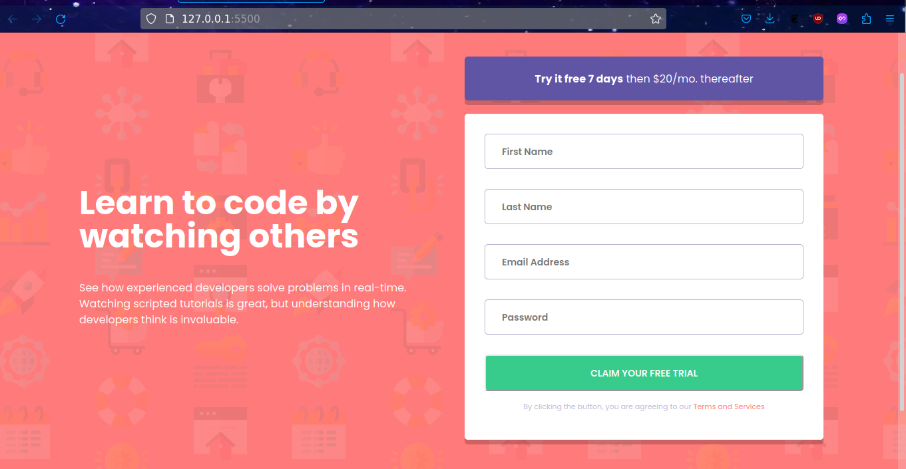

# Frontend Mentor - Intro component with sign up form solution

This is a solution to the [Intro component with sign up form challenge on Frontend Mentor](https://www.frontendmentor.io/challenges/intro-component-with-signup-form-5cf91bd49edda32581d28fd1). Frontend Mentor challenges help you improve your coding skills by building realistic projects. 

## Table of contents

- [The challenge](#the-challenge)
  - [Screenshot](#screenshot)
  - [Links](#links)
- [My process](#my-process)
  - [Built with](#built-with)
  - [What I learned](#what-i-learned)
  - [Useful resources](#useful-resources)
- [Author](#author)
- [Acknowledgments](#acknowledgments)

## The challenge

Users should be able to:

- View the optimal layout for the site depending on their device's screen size
- See hover states for all interactive elements on the page
- Receive an error message when the `form` is submitted if:
  - Any `input` field is empty. The message for this error should say *"[Field Name] cannot be empty"*
  - The email address is not formatted correctly (i.e. a correct email address should have this structure: `name@host.tld`). The message for this error should say *"Looks like this is not an email"*

### Screenshot

### Links

- Solution URL: [Add solution URL here](https://your-solution-url.com)
- Live Site URL: [Add live site URL here](https://your-live-site-url.com)

## My process

1. I started with writing the HTML.
2. After I finished HTML, I wrote CSS for the main page without active states.
3. Added the error messages on the form as part of active state. 
4. Then I worked on the mobile version to make it responsive.
5. Finally I wrote the JavaScript.

### Built with

- Semantic HTML5 markup
- CSS custom properties
- Flexbox
- Mobile-first workflow

### What I learned

This project helped me in improving my CSS and JavaScript more. I was able to manipulate DOM elements and I used position properties in CSS.

### Useful resources

- [YT video by Florin Pop](https://www.youtube.com/watch?v=bFOuUypjkSM&t=4589s) - This helped me for styling the active state error messsages. I really liked this pattern.

## Author

- GitHub - [@VaibhavSinghDev](https://www.github.com/VaibhavSinghDev)
- Frontend Mentor - [@VaibhavSinghDev](https://www.frontendmentor.io/profile/VaibhavSinghDev)
- Twitter - [@VaibhavSinghDev](https://www.twitter.com/VaibhavSinghDev)

## Acknowledgments

While working on this project, I was having trouble with some css and I looked for solutions and got a solution on a youtube video of Florin Pop.
I learned some new things from his solution so it is important to give him credit. 
Here is the link to the video: https://www.youtube.com/watch?v=bFOuUypjkSM&t=4589s
